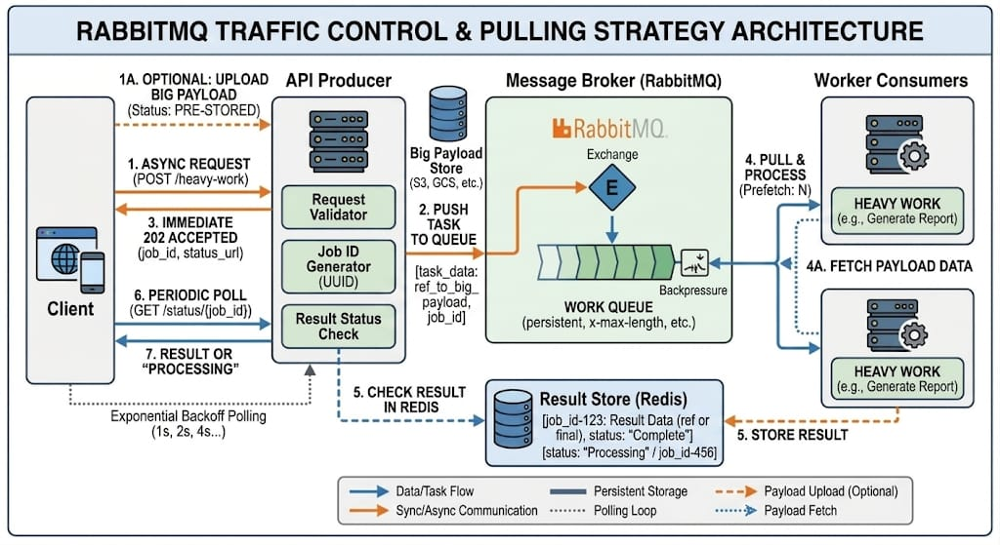

# WEX Purchase Transaction System

A robust, microservices-based asynchronous system designed to handle purchase transactions with multi-currency support and historical exchange rate conversion.

## 🏗️ Architecture Overview

The system follows an **Event-Driven, Hexagonal Architecture** (Ports and Adapters) to ensure high decoupling and scalability. It utilizes a producer-consumer pattern for processing transactions and currency conversions asynchronously.



### Core Technologies
- **Language**: Go (Golang)
- **Dependency Injection**: Google Wire
- **Messaging**: RabbitMQ
- **State & Caching**: Valkey (High-performance Redis fork)
- **Database**: PostgreSQL (with Flyway for migrations)
- **Orchestration**: Docker Compose

---

## 🛠️ Microservices

### 1. API Service (Gateway)
The entry point for the system. It handles incoming HTTP requests, validates payloads, and decouples the user from heavy processing by offloading jobs to RabbitMQ and Valkey.

### 2. Transaction Service
The persistence worker. It consumes jobs from the `transaction_jobs` queue, updates the transaction lifecycle (PENDING -> PROCESSING -> COMPLETED), and ensures canonical storage in PostgreSQL.

### 3. Conversion Service
The calculation engine. It handles asynchronous currency conversion requests. It fetches historical rates, performs precision-safe calculations using `decimal` logic, and stores the final results in Valkey for retrieval.

---

## 🚀 API Endpoints

### Transactions
- **`POST /transactions`**: Create a new purchase transaction in USD.
    - *Returns*: `202 Accepted` with a Transaction ID.
- **`GET /transactions/status/{id}`**: Retrieve the full payload and current status of a transaction.

### Currency Conversion
- **`POST /transactions/{id}/convert?currency={CODE}`**: Request an asynchronous currency conversion.
    - *Returns*: `202 Accepted` with a Valkey key to track the result.
- **`GET /transactions/{id}/convert?currency={CODE}`**: Retrieve the conversion result from Valkey.
    - *Returns*: Full conversion details (Original USD, Exchange Rate, Converted Amount, Message).

---

## ⚙️ Configuration & Setup

### Environment Variables
The system is configured via a centralized `.env` file in the root directory. Key variables include:
- `POSTGRES_USER`, `POSTGRES_PASSWORD`, `POSTGRES_DB`
- `RABBITMQ_URL`
- `VALKEY_URL`

### Running with Docker
```bash
# Start all services and run migrations
make up

# Run unit tests
make test

# Generate Dependency Injection code
make wire
```

## 📐 Design Patterns
- **Hexagonal Architecture**: Core business logic is isolated from infrastructure (Postgres, RabbitMQ) via Ports and Adapters.
- **Statelessness**: All services are stateless, allowing for horizontal scaling.
- **Decoupling**: The API producer never interacts directly with the database, ensuring high availability even during DB maintenance.
