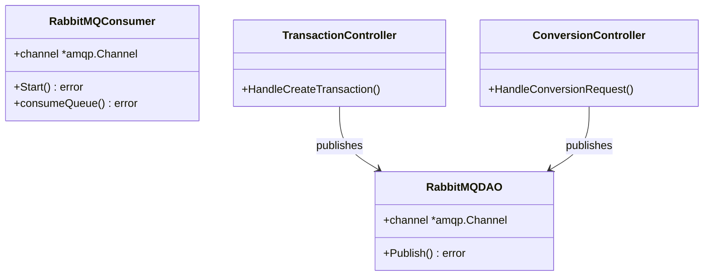

# Traffic Control Strategy Implementation

## Requirements
Implement a traffic control strategy with load leveling, backpressure, and fair dispatch to protect system stability when high traffic occurs by actively refusing new work (returning HTTP 429) rather than crashing or infinitely buffering when RabbitMQ queues are overloaded.

## Entities

## Approach
1. **Backpressure (API Publisher)**:
   - Enable publisher confirms on the RabbitMQ channel.
   - Use `PublishWithDeferredConfirmWithContext` to wait for RabbitMQ to accept or reject the message.
   - If the queue is full and rejects the publish, return a specific business error (`domain.ErrTooManyRequests`).
   - The API controllers will catch this error and return an HTTP `429 Too Many Requests` response.

2. **Queue Configuration & Load Leveling (Infrastructure)**:
   - Configure the RabbitMQ queues with `x-max-length` and `x-overflow: reject-publish` to prevent unbounded growth and enforce backpressure.

3. **Fair Dispatch (Consumer)**:
   - Configure the consumer channel with `basicQos(prefetchCount: 1)` so workers only pull one message at a time.
   - Disable `autoAck` and implement manual acknowledgment `d.Ack(false)` after the worker has completely finished processing the message.

## Structure

### Dependencies
1. `TransactionController` and `ConversionController` depend on services which depend on `RabbitMQPublisher`.
2. `RabbitMQPublisher` depends on `RabbitMQDAO`.
3. `RabbitMQConsumer` directly interacts with the RabbitMQ channel to manage QoS and acknowledgments.

### Layered Architecture
1. **Controller Layer**: Intercepts `ErrTooManyRequests` and formats `429` responses.
2. **DAO Layer (`RabbitMQDAO`)**: Implements publisher confirms and translates Nacks to `ErrTooManyRequests`.
3. **Consumer Layer (`RabbitMQConsumer`)**: Enforces QoS and explicit ACKs.

## Operations

### Update Domain Errors - `domain/errors.go`
1. Responsibility: Define standard error for queue overflow.
2. Methods/Variables:
   - Add `var ErrTooManyRequests = errors.New("too many requests")` in `api_service/src/core/domain/errors.go` (and wherever applicable if missing).

### Implement RabbitMQDAO - `api_service/src/infra/dao/rabbitmq_dao.go`
1. Interface Definition: Publisher DAO
2. Core Methods:
   - Update `NewRabbitMQDAO(channel *amqp.Channel)`:
     - Call `channel.Confirm(false)` to put the channel in confirm mode.
   - Update `Publish` method:
     - Replace `PublishWithContext` with `PublishWithDeferredConfirmWithContext`.
     - Logic:
       - `conf, err := d.channel.PublishWithDeferredConfirmWithContext(...)`
       - `if err != nil { return err }`
       - `if !conf.Wait() { return domain.ErrTooManyRequests }`
       - Return `nil` if successful.

### Implement RabbitMQConsumer - `transaction_service/src/infra/rabbitmq_consumer.go` & `conversion_service/src/infra/rabbitmq_consumer.go`
1. Core Methods:
   - Update `consumeQueue` method:
     - Logic:
       - Create an `amqp.Table` for arguments: `args := amqp.Table{"x-max-length": 10000, "x-overflow": "reject-publish"}`.
       - Pass `args` instead of `nil` to `c.channel.QueueDeclare`.
       - Add `c.channel.Qos(1, 0, false)` before `c.channel.Consume`.
       - Change `autoAck` (the 3rd argument in `Consume`) from `true` to `false`.
       - In the message loop (`for d := range msgs`), call `d.Ack(false)` explicitly after `handler(ctx, id)` returns, regardless of whether it returned an error (to prevent infinite requeue loops on permanent failures, or handle requeueing explicitly if desired, but for this requirement explicit `Ack` is sufficient to meet the basic Qos rule).
   
### Update Controllers - `api_service/src/controllers/transaction_controller.go` & `conversion_controller.go`
1. Responsibility: Map queue rejection to HTTP responses.
2. Core Methods:
   - Update `HandleCreateTransaction` and `HandleConversionRequest` (if applicable).
   - Logic:
     - Check `if errors.Is(err, domain.ErrTooManyRequests)`.
     - Return `http.Error(w, "Too Many Requests", http.StatusTooManyRequests)` (429) if true.

## Norms
1. **Exception Handling**: Use `errors.Is` to check for specific business exceptions like `ErrTooManyRequests` so that architectural boundaries are maintained.
2. **Reliable Messaging**: Always use publisher confirms when dropping messages is unacceptable or when backpressure signaling is required.
3. **Consumer Idempotency**: Explicit manual ACKs must be sent only after processing finishes.

## Safeguards
1. **Performance Constraints**: Publisher confirms (`conf.Wait()`) add synchronous network latency. The system must tolerate this latency to guarantee backpressure.
2. **Deployment Constraints**: Existing queues in RabbitMQ cannot have their `x-max-length` altered dynamically via `QueueDeclare` if they were already created without it. A redeclaration error will occur. This must be handled via environment recreation or policies in production, but for code-level safeguards, ensure the code declares it correctly.
3. **Business Rule Constraints**: The API must return a 429 response when the queue is full, preventing any new jobs from being lost or crashing the services.
