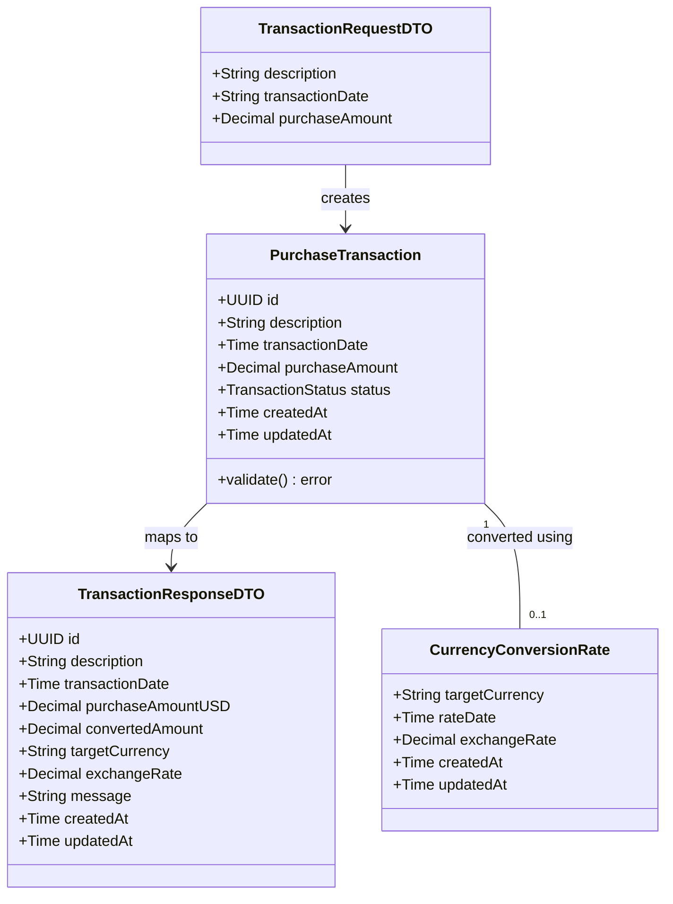

# Store Purchase Transaction API

## Requirements
Implement a reliable, asynchronous system to accept, validate, and store purchase transactions in USD, and provide functionality to retrieve these transactions with accurate currency conversion based on historical exchange rates.

## Entities

## Approach
1. Asynchronous Processing:
   - Implement an event-driven architecture where the API producer stores the payload temporarily in Valkey and pushes a job message to a RabbitMQ queue.
   - A separate worker/consumer process will pull the job from the queue and persist the `PurchaseTransaction` into PostgreSQL.
   - For currency conversion, the `conversion-service` tracks async status via `conversion_status:{id}:{currency}` and stores final results in `conversion:{id}:{currency}` in Valkey.

2. Technical Implementation:
   - Language: GoLang
   - Framework/DI: Google Wire for dependency injection
   - Configuration: Centralized `.env` file loaded via `joho/godotenv`.
   - Architecture: Hexagonal / Clean Architecture (S.O.L.I.D principles)
   - Persistence: PostgreSQL for canonical storage, Valkey for job requests/status, RabbitMQ for message queuing.
   - Money Handling: Use `shopspring/decimal` to avoid floating-point precision loss.

3. Business Logic:
   - Input validation: Description <= 50 chars, Amount > 0, valid dates.
   - Conversion logic: Fetch the latest conversion rate that is `<= transactionDate` and within a 6-month window prior to the transaction date.
   - Fail gracefully with specific business errors if no valid conversion rate is found.

## Structure

### Inheritance Relationships
1. `TransactionRepository` interface defines persistence operations.
2. `PostgresTransactionRepository` implements `TransactionRepository`.
3. `MessagePublisher` interface defines queue operations.
4. `RabbitMQPublisher` implements `MessagePublisher`.
5. `ConversionRateProvider` interface defines rate fetching.
6. `PayloadStore` interface defines Valkey state management.

### Dependencies
1. `TransactionController` depends on `TransactionProducerService`.
2. `TransactionProducerService` depends on `MessagePublisher` and `PayloadStore` (Valkey).
3. `TransactionConsumerWorker` depends on `TransactionRepository` and `PayloadStore`.
4. `TransactionQueryService` depends on `TransactionRepository`, `ConversionRateProvider`, and `PayloadStore`.

### Layered Architecture
1. `src/controllers`: HTTP handlers for producing messages and querying data.
2. `src/core`: Domain Entities, Service Interfaces (Ports), and Business Logic.
3. `src/infra`: Data access (Postgres, Valkey, RabbitMQ), SQL queries package, and DI setup.

## Operations

### Create Domain Models - src/core/domain
1. Responsibility: Define core business entities.
2. Attributes: `PurchaseTransaction` includes `ID`, `Description`, `TransactionDate`, `Amount`, `Status`, `CreatedAt`, `UpdatedAt`.
3. Methods: `Validate()` returns error if description > 50 chars or amount <= 0.

### Implement Transaction Service - src/core/services
1. Responsibility: Orchestrate transaction persistence and state transitions.
2. Core Methods:
   - `ProcessTransaction`: Retrieve payload, update status to `PROCESSING`, save to Postgres, update status to `COMPLETED`.
   - Timestamps: Initialize `CreatedAt`/`UpdatedAt` on creation and refresh `UpdatedAt` on state changes.

### Implement Conversion Service - src/core/services
1. Responsibility: Handle asynchronous currency conversion requests.
2. Core Methods:
   - `GetConvertedTransaction`: Fetch rate, calculate amount, track status in Valkey (`COMPLETED`/`FAILED`), and store results with descriptive `Message`.
3. Error Handling: Update Valkey status to `FAILED` if rate is unavailable.

### Create Controllers - src/controllers
1. Methods:
   - `POST /transactions`: Returns 202 Accepted with Transaction ID.
   - `POST /transactions/{id}/convert`: Triggers conversion, returns 202 with Valkey result key.
   - `GET /transactions/{id}/convert`: Fetches conversion result from Valkey.

### Implement Infrastructure - src/infra
1. SQL Queries: Store all SQL instructions as constants in `src/infra/queries`.
2. Repositories:
   - `PostgresTransactionRepository`: Delegates execution to a generic `PostgresDAO`.
   - `ValkeyPayloadStore`: Manages JSON serialization/deserialization for Redis/Valkey.
3. DI: Provide Wire sets for all components, utilizing `InitializeAPI` and `InitializeWorker`.

### Create flyway sql files
1. Migration V1: Base schema for transactions.
2. Migration V2: Schema for conversion rates.
3. Migration V3: Added `status` column to `purchase_transactions`.
4. Makefile: Commands for `migrate`, `rollback`, `clean`, `validate`.

## Norms
1. SQL Management: SQL strings MUST be constants in the `queries` package.
2. Async Visibility: DTOs MUST include a `Message` field to explain job status/results.
3. Decoupling: Repositories MUST use DAOs for database interaction to separate query logic from execution.
4. Error Handling: Map core errors to HTTP codes and update Valkey status on failures.

## Safeguards
1. Constraints: Description <= 50 chars, Amount > 0.
2. Business Rules: Rate date <= Purchase date AND within 6 months.
3. Isolation: API producers MUST decouple from the database using RabbitMQ/Valkey.
4. Testing: Comprehensive unit tests required for `conversion_service` and `transaction_service` using mocks.
5. Observability: Structured logging for all service operations and error states.
