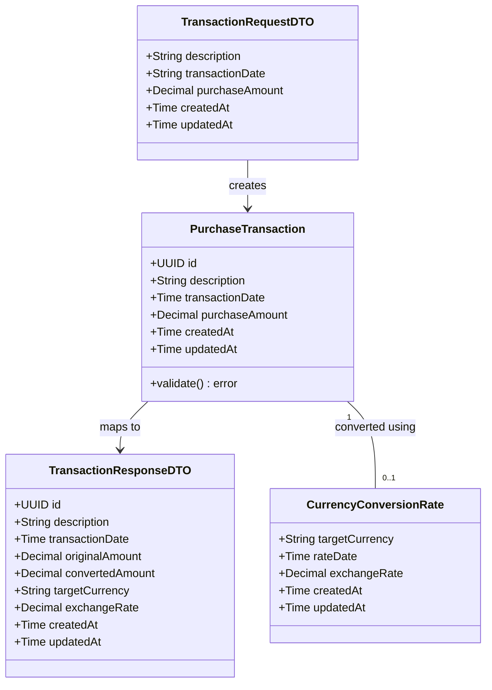

# Store Purchase Transaction API

## Requirements
Implement a reliable, asynchronous system to accept, validate, and store purchase transactions in USD, and provide functionality to retrieve these transactions with accurate currency conversion based on historical exchange rates.

## Entities

## Approach
1. Asynchronous Processing:
   - Implement an event-driven architecture where the API producer stores the payload temporarily in Valkey and pushes a job message to a RabbitMQ queue.
   - A separate worker/consumer process will pull the job from the queue and persist the `PurchaseTransaction` into PostgreSQL.

2. Technical Implementation:
   - Language: GoLang
   - Framework/DI: Google Wire for dependency injection
   - Architecture: Hexagonal / Clean Architecture (S.O.L.I.D principles)
   - Persistence: PostgreSQL for canonical Valkey, Valkey for job requests, Valkey for payload store, RabbitMQ for message queuing
   - Money Handling: Use a dedicated Go decimal library (e.g., `shopspring/decimal`) to avoid floating-point precision loss.

3. Business Logic:
   - Input validation: Description <= 50 chars, Amount > 0, valid dates.
   - Conversion logic: Fetch the latest conversion rate that is `<= transactionDate` and within a 6-month window prior to the transaction date.
   - Fail gracefully with specific business errors if no valid conversion rate is found.

## Structure

### Inheritance Relationships
1. `TransactionRepository` interface defines persistence operations.
2. `PostgresTransactionRepository` implements `TransactionRepository`.
3. `MessagePublisher` interface defines queue operations.
4. `RabbitMQPublisher` implements `MessagePublisher`.
5. `ConversionRateProvider` interface defines rate fetching.

### Dependencies
1. `TransactionController` depends on `TransactionProducerService`.
2. `TransactionProducerService` depends on `MessagePublisher` and `PayloadStore` (Valkey).
3. `TransactionConsumerWorker` depends on `TransactionRepository`.
4. `TransactionQueryService` depends on `TransactionRepository` and `ConversionRateProvider`.

### Layered Architecture
1. `src/controllers`: Contains HTTP handlers (REST API) for producing messages and querying data.
2. `src/core`: Contains Domain Entities, Service Interfaces, Use Cases, and Business Logic. Independent of frameworks.
3. `src/infra`: Contains PostgreSQL repositories, RabbitMQ integrations, Valkey clients, external API clients, and Google Wire setups.

## Operations

### Create Domain Models - src/core/domain
1. Responsibility: Define core business entities.
2. Attributes:
   - `PurchaseTransaction`: `ID` (UUID), `Description` (string), `TransactionDate` (time.Time), `Amount` (decimal.Decimal).
3. Methods:
   - `Validate()`: Returns error if description > 50 chars or amount <= 0.
4. Constraints: Must not import any packages from `infra` or `controllers`.

### Implement Producer Service - src/core/services
1. Interface Definition: `CreateTransaction(ctx context.Context, req TransactionRequestDTO) (UUID, error)`
2. Core Methods:
   - Input Validation: Call entity `Validate()`.
   - Business Logic: Generate UUID, store full payload in Valkey, push job to RabbitMQ queue with the UUID reference.
3. Dependency Injection: Requires `MessagePublisher` and `PayloadStore`.
4. Constraints: Must be a singleton

### Implement Query Service - src/core/services
1. Interface Definition: `GetConvertedTransaction(ctx context.Context, id UUID, targetCurrency string) (TransactionResponseDTO, error)`
2. Core Methods:
   - Business Logic: Fetch transaction from DB. If `targetCurrency` is provided, fetch conversion rate (<= transactionDate and within 6 months). Multiply amount by rate and round to 2 decimal places. Return formatted response.
   - Exception Handling: Return clear error if rate is unavailable within the 6-month window.
3. Constraints: Must be a singleton

### Create Controllers - src/controllers
1. Responsibility: HTTP request parsing and response formatting.
2. Methods:
   - `POST /transactions`: Binds JSON to DTO, calls Producer Service, returns 202 Accepted with Transaction ID.
   - `GET /transactions/{id}`: Accepts optional `?currency=XYZ` param, calls Query Service, returns 200 OK or 404/400.

### Implement Infrastructure - src/infra
1. Responsibility: Implement data access and external integrations.
2. Methods:
   - `PostgresTransactionRepository`: SQL queries to store and retrieve transactions.
   - `RabbitMQPublisher`: Publish message to exchange/queue.
   - `RedisJobStore`: Set and Get payload data.
3. Dependency Injection: Provide Wire provider sets (`wire.NewSet`) for all infra components.

### Create flyway sql files
1. folder flyway
2. create a makefile for flyway commands: 
   - migrate: run flyway migrate command
   - rollback: run flyway rollback command
   - clean: run flyway clean command
   - validate: run flyway validate command
3. create a sql file for the purchase transaction table
4. create a sql file for the currency conversion rate table

### Configure Dependency Injection - src/infra/di
1. Responsibility: Setup Google Wire.
2. Methods:
   - `InitializeAPI()`: Returns HTTP router/app with all dependencies injected.
   - `InitializeWorker()`: Returns RabbitMQ consumer worker with all dependencies injected.

## Norms
1. Code Organization: Strict adherence to the `core`, `infra`, `controllers` folder structure.
2. Dependency Injection: Use Google Wire exclusively. Avoid global state.
3. Exception Handling:
   - Use custom error types in `core` (e.g., `ErrValidation`, `ErrNotFound`, `ErrNoConversionRate`).
   - Controllers must translate these into appropriate HTTP status codes (400, 404, 422).
4. Money: Always use `decimal.Decimal` for currency amounts. Never use `float64`.
5. Documentation: Godoc comments on all exported interfaces and types.
6. DTOs and domain/services Interfaces shoul be in /core/ports folder.
7. DTOs must not have validation logic.
8. Domain must have validation logic.

## Safeguards
1. Functional Constraints: Description length MUST NOT exceed 50 characters. Purchase amount MUST be > 0.
2. Business Rule Constraints: Currency conversion rate MUST be less than or equal to the purchase date AND within exactly 6 months prior.
3. Integration Constraints: The API producer must safely decouple from the database by utilizing RabbitMQ and Valkey
4. Exception Handling Constraints: If no currency rate is found in the 6-month window, the query MUST fail with a specific business error, not a generic 500.
5. Technical Constraints: S.O.L.I.D. principles must be followed. The `core` package must have zero dependencies on `infra` or external libraries other than the decimal package.
6. Write unit-test for domain, services and infra packages 
