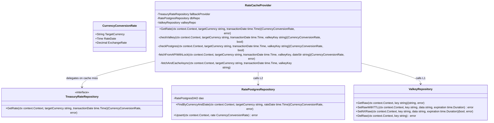

# Multi-Layer Rate Cache Implementation

## Requirements
Implement a resilient multi-layer cache strategy prioritizing Valkey (L1) and Postgres (L2) before falling back to the external Treasury API for currency exchange rates, ensuring idempotency and preventing duplicate concurrent API calls.

## Entities

## Approach
1. Orchestration:
   - Introduce `RateCacheProvider` implementing `TreasuryRateRepository` (or wrapping it) to handle the L1 -> L2 -> Fallback logic.
   - Use `go-redis/v9` (via `ValkeyRepository`) for Valkey interaction and distributed locking (`SETNX`).
   
2. Technical Implementation:
   - **L1 Cache (Valkey)**: Store rates with a computed TTL. Format key as `rate:{currency}:{YYYY-MM-DD}`.
   - **L2 Cache (Postgres)**: Read from and UPSERT to `currency_conversion_rates`.
   - **Concurrency Control**: Use a Valkey lock `lock:rate:{currency}:{YYYY-MM-DD}` to prevent concurrent API fetches.
   - **Stale-while-revalidate**: Check TTL/stale meta. If stale, return the value and spawn a goroutine to fetch fresh data.

3. Database Update:
   - Add a new Flyway migration `V4__add_unique_constraint_to_currency_rates.sql` introducing `UNIQUE(target_currency, rate_date)` to enable Postgres `ON CONFLICT` UPSERT operations.

## Structure

### Dependencies
1. `RateCacheProvider` wraps `TreasuryRateRepository`
2. `RateCacheProvider` calls `RatePostgresRepository`
3. `RateCacheProvider` calls `ValkeyRepository`

### Layered Architecture
1. Core Domain: Defines `CurrencyConversionRate`
2. Providers Layer: `RateCacheProvider` (in `infra/providers`) orchestrates caching
3. Repository Layer: `RatePostgresRepository`, `TreasuryRateRepository`, and `ValkeyRepository` (in `infra/repositories`) handle data access and external API

## Operations

### Create V4 Flyway Migration
1. Responsibility: Add unique constraint to `currency_conversion_rates`
2. Logic: `ALTER TABLE currency_conversion_rates ADD CONSTRAINT unique_target_currency_rate_date UNIQUE (target_currency, rate_date);`

### Implement RatePostgresRepository
1. Responsibility: Provide DB access for the L2 cache
2. Core Methods:
   - `FindByCurrencyAndDate(ctx, targetCurrency, rateDate)`
     - Execute `queries.FindByCurrencyAndDate` query from `infra/queries/rate_sql.go`.
   - `Upsert(ctx, rate)`
     - Execute `queries.UpsertCurrencyRate` query from `infra/queries/rate_sql.go`.

### Implement RateCacheProvider
1. Responsibility: Multi-layer caching and API orchestration
2. Core Methods:
   - `GetRate(ctx, targetCurrency, transactionDate)`:
     - Orchestrates the caching logic by delegating to private methods.
   - `checkValkey(ctx, targetCurrency, transactionDate, valkeyKey)`:
     - Checks Valkey via `ValkeyRepository.GetRaw`.
     - If hit and valid: return.
     - If hit and stale: spawn background refresh (`fetchAndCacheAsync`), return stale data.
   - `checkPostgres(ctx, targetCurrency, transactionDate, valkeyKey)`:
     - Checks `RatePostgresRepository`.
     - If Postgres hit: cache in Valkey, return.
   - `fetchFromAPIWithLock(ctx, targetCurrency, transactionDate, valkeyKey, dateStr)`:
     - Acquire Valkey lock `lock:rate:{...}` via `ValkeyRepository.SetNXRaw`.
     - If lock acquired: call `TreasuryRateRepository`, `Upsert` to Postgres, cache to Valkey, return.
     - If lock failed: wait and retry reading from Valkey.
   - `fetchAndCacheAsync(...)`: Background goroutine to fetch and update L2/L1.

## Norms
1. Error Handling: Return stale data on fallback failure if available, else standard Go error.
2. Idempotency: Rely strictly on Postgres `ON CONFLICT` for idempotency to handle race conditions that bypass the Valkey lock.
3. Locking: Distributed lock must use a safe timeout (e.g. 10s) to avoid deadlocks on node crashes.
4. Queries: SQL queries must be extracted from repository files and maintained as constants within the `infra/queries/` package to decouple data access logic from raw SQL strings.

## Safeguards
1. Functional Constraints: Must prioritize L1 then L2 before API.
2. Data Constraints: Must not create duplicate rates per `(target_currency, rate_date)`.
3. Exception Handling Constraints: Fallback gracefully to stale data on API timeouts or failures.
