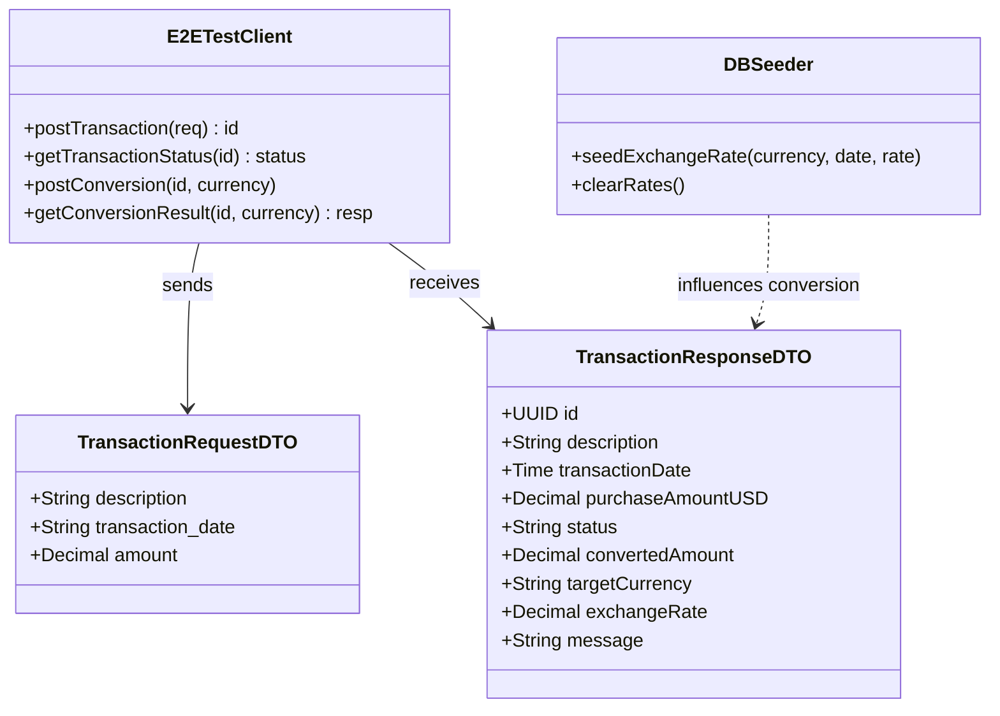

# E2E Tests Implementation for Store and Convert Transactions

## Requirements
Implement a dedicated End-to-End (E2E) test suite to validate the integrated flow of the Purchase Transaction system, ensuring that transactions are correctly validated, stored, and converted across microservice boundaries (API, Transaction, and Conversion services) while strictly adhering to rounding and 6-month historical rate selection rules.

## Entities

## Approach
1. **Black-Box API Testing**: The test suite will interact with the system primarily through the `api_service` public endpoints (localhost:8080 or as configured), simulating real-world client interactions.
2. **Asynchronous Orchestration**: 
   - Implement a robust polling mechanism with retries and exponential backoff to handle the asynchronous processing performed by the `transaction_service` and `conversion_service`.
   - Each polling attempt will have a maximum timeout to prevent test hangs.
3. **Controlled State Seeding**:
   - For conversion tests, the suite will directly connect to the PostgreSQL database to seed specific historical exchange rates. This is essential for verifying the "closest previous rate within 6 months" logic.
4. **Precision Validation**:
   - Use `shopspring/decimal` (matching the codebase) to compare amounts and rates, ensuring rounding to exactly two decimal places is correctly implemented.
5. **Isolation Strategy**:
   - Generate unique transaction descriptions and metadata for each test case to prevent cross-test data pollution in shared environments.

## Structure

### Inheritance Relationships
1. `E2ETestSuite` uses Go's `testing.T`.
2. `E2EClient` implements high-level API interaction logic.

### Dependencies
1. `e2e_tests` depends on `net/http` for API calls.
2. `e2e_tests` depends on `github.com/stretchr/testify/assert` for assertions.
3. `e2e_tests` depends on `lib/pq` (or similar) for direct DB seeding.
4. `e2e_tests` depends on `github.com/shopspring/decimal` for currency precision.

### Layered Architecture (Tests)
1. **Test Layer**: Contains the `*_test.go` files with specific business scenarios.
2. **Client Layer**: `helpers.go` containing the HTTP client and polling logic.
3. **Infra Layer**: Database connection and seeding utilities for environment setup.

## Operations

### Create E2E Test Helpers - helpers.go
1. Responsibility: Provide a unified client for interacting with the API and polling for results.
2. Methods:
   - `createTransaction(t *testing.T, req DTO): string`: Sends POST /transactions, returns ID.
   - `waitForStatus(t *testing.T, id string, targetStatus string): void`: Polls GET /transactions/{id}/status until target status or timeout.
   - `requestConversion(t *testing.T, id string, currency string): void`: Sends POST /transactions/{id}/convert.
   - `waitForConversion(t *testing.T, id string, currency string): ResponseDTO`: Polls GET /transactions/{id}/convert until result exists or timeout.

### Implement Purchase Validation Tests - purchase_test.go
1. Responsibility: Verify all storage and validation ACs.
2. Scenarios:
   - `TestStoreValidTransaction`: Verify 202 Accepted and non-empty ID.
   - `TestDescriptionLength`: Test 50 (pass) and 51 (fail) characters.
   - `TestAmountValidation`: Test negative (fail), zero (fail), and 0.01 (pass).
   - `TestAmountRounding`: POST 10.005, verify stored 10.01.

### Implement Conversion Logic Tests - conversion_test.go
1. Responsibility: Verify 6-month rule and conversion accuracy.
2. Scenarios:
   - `TestSuccessfulConversion`: Seed rate for date, request conversion, verify calculation.
   - `TestSixMonthLookback`: Seed rate 5 months prior, verify it's used.
   - `TestSixMonthBoundary`: Seed rate exactly 6 months prior, verify it's used.
   - `TestConversionFailure`: Seed rate 7 months prior, verify conversion error.
   - `TestRoundingConvertedAmount`: Verify conversion result is rounded to 2 decimals.
   - `TestUnsupportedCurrency`: Verify error for non-existent currency.

### Implement DB Seeding Utility - db_utils.go
1. Responsibility: Direct DB access for seeding rates.
2. Methods:
   - `SeedRate(currency, date, rate)`: Inserts/Upserts into `currency_conversion_rates`.
   - `CleanupRates()`: Deletes test-seeded rates.

## Norms
1. **Naming**: Test functions must follow `Test[Feature][Scenario]` pattern.
2. **Assertions**: Always provide descriptive failure messages in `assert` calls.
3. **Environment**: Read API and DB connection strings from environment variables with sensible defaults.
4. **Wait Strategy**: Default polling interval: 500ms; Max timeout: 10s per async step.

## Safeguards
1. **Service Check**: The test suite must fail fast if the API service is not reachable.
2. **Clean State**: Ensure each test starts with a "virtual" clean state by using unique data identifiers.
3. **Precision**: All monetary comparisons must use a delta of 0.0001 or exact decimal comparison to avoid rounding noise.
4. **Timeout**: Tests must not run indefinitely; use `context.WithTimeout` for all network and polling operations.
5. **No Data Exposure**: Ensure test logs do not leak sensitive environment credentials if running in CI.
